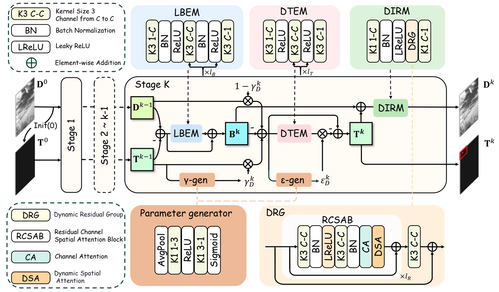

# ✨ DRPCA-Net: Make Robust PCA Great Again for Infrared Small Target Detection

<p align="center">
  
  
  
</p>

> **Authors:** Zihao Xiong, Fei Zhou, Fengyi Wu, Shuai Yuan, Maixia Fu, Zhenming Peng, Jian Yang, Yimian Dai  
> Official implementation of "**DRPCA-Net: Make Robust PCA Great Again for Infrared Small Target Detection**".

---

## 📜 Table of Contents

- [Abstract](#-abstract)
- [Installation](#-installation)
- [Dataset Preparation](#-dataset-preparation)
- [Training](#-training)
- [Testing](#-testing)
- [Model Zoo and Benchmark](#-model-zoo-and-benchmark)
- [Citation](#-citation)
- [Acknowledgements](#-acknowledgements)

---

## 🚀 Abstract

Infrared small target detection plays a critical role in remote sensing, industrial monitoring, and civilian applications.

Despite the progress of deep learning methods, many end-to-end models sacrifice interpretability and generalization. These models often ignore the intrinsic **sparsity prior** of infrared small targets — a fundamental cue.

**DRPCA-Net** rethinks this by:
- Revisiting traditional **Robust PCA** with deep learning.
- Introducing **Dynamic Unfolding** through a **lightweight hypernetwork**.
- Proposing a **Dynamic Residual Group (DRG)** to handle complex backgrounds.

**Outcome:** Superior robustness, generalization, and efficiency, validated across multiple public datasets.

---

## 🏗 Architecture



## 📦 Installation

### Step 1. Clone the repository

```bash
git clone https://github.com/GrokCV/DRPCA-Net.git
cd DRPCA-Net
```

### Step 2. Create environment and install dependencies

```bash
conda create -n drpcanet python=3.9
conda activate drpcanet
conda install pytorch torchvision torchaudio pytorch-cuda=11.8 -c pytorch -c nvidia
pip install -r requirements.txt
```
## 📚 Dataset Preparation

### Datasets Link

We used **SIRSTV1**, **NUDT-SIRST**, **IRSTD-1K** and **SIRST-Aug** for both training and test.

- **NUDT-SIRST** can be found and downloaded here: [NUDT-SIRST](https://github.com/YeRen123455/Infrared-Small-Target-Detection)
- **IRSTD-1K** can be found and downloaded here: [IRSTD-1K](https://github.com/RuiZhang97/ISNet)
- **SIRST-Aug** can be found and downloaded here: [SIRST-Aug](https://github.com/Tianfang-Zhang/AGPCNet)
- **SIRSTV1** can be found and downloaded here: [SIRSTV1](https://github.com/YimianDai/open-sirst-v2)

Note:   
    
You can also refer to [Google Drive](https://drive.google.com/file/d/1rs6ORtekqHmuPEPhyq61iPPVOxx2QF7B/view?usp=drive_link). - Wu Fengyi's settings for ready-to-use datasets.

For the **SIRSTV1** dataset, we still maintain the structure provided by the official source.
<!-- The NoisySIRST dataset can be accessible via:
https://drive.google.com/drive/folders/1RGpVHccGb8B4_spX_RZPEMW9pyeXOIaC?usp=sharing -->

Please first download these datasets and place the 4 datasets to the folder `./datasets/`

### File Structure
```
├──./datasets/
│    ├── NUDT-SIRST/ & IRSTD-1k/ & sirst_aug/
│    │    ├── trainval
│    │    │    ├── images
│    │    │    │    ├── 000002.png
│    │    │    │    ├── 000004.png
│    │    │    │    ├── ...
│    │    │    ├── masks
│    │    │    │    ├── 000002.png
│    │    │    │    ├── 000004.png
│    │    │    │    ├── ...
│    │    ├── test
│    │    │    ├── images
│    │    │    │    ├── 000001.png
│    │    │    │    ├── 000003.png
│    │    │    │    ├── ...
│    │    │    ├── masks
│    │    │    │    ├── 000001.png
│    │    │    │    ├── 000003.png
│    │    │    │    ├── ...
```

Please make sure that the path of your data set is consistent with the `data_root` in `configs/_base_/datasets/dataset_name.py`


## 🏋️‍♂️ Training

Run`run_configs.py` to perform network training:
```bash
$ python run_configs.py
```
In the `run_configs.py` file, by setting parameters such as data_irstd1k, data_sirstaug, data_nudt, and SirstDataset, you can respectively run the corresponding datasets for training.

## 🔍 Testing

Run `inference.py` to generate file of the format .mat and .png:
```bash
$ python inference.py
```
In the inference.py script, you can perform inference on different datasets by specifying the dataset_name parameter with one of the following options: NUDT-SIRST, IRSTD-1k, sirst_aug, or SIRSTv1. Each value corresponds to a specific dataset configuration.

Result files (.png and .mat) will be saved to:
```
├──./results/
│    ├── [dataset_name]
│    │   ├── img
│    │   │    ├── 000000.png
│    │   │    ├── 000001.png
│    │   │    ├── ...
│    │   ├── mat
│    │   │    ├── 000000.mat
│    │   │    ├── 000001.mat
│    │   │    ├── ...
```
Run `cal_from_mask.py` for direct evaluation:
```bash
$ python cal_from_mask.py
```
In the cal_from_mask.py file, you can calculate metrics such as mIoU, F1, Pd, and Fa for the inference results of corresponding datasets by setting the data_list parameter to one of the following values: NUDT-SIRST, IRSTD-1k, sirst_aug, or SIRSTv1.
## 🏆 Model Zoo and Benchmark


### Leaderboard
## Performance comparison of different methods

| Methods | Params | SIRST V1 |  |  |  | NUDT-SIRST |  |  |  | SIRST-Aug |  |  |  | IRSTD-1K (Failure Case) |  |  |  |
| :--- | :---: | :---: | :---: | :---: | :---: | :---: | :---: | :---: | :---: | :---: | :---: | :---: | :---: | :---: | :---: | :---: | :---: |
| | | IoU ↑ | F1 ↑ | Pd ↑ | Fa ↓ | IoU ↑ | F1 ↑ | Pd ↑ | Fa ↓ | IoU ↑ | F1 ↑ | Pd ↑ | Fa ↓ | IoU ↑ | F1 ↑ | Pd ↑ | Fa ↓ |
| **Traditional Methods** ||||||||||||||||
| Tophat | - | 26.93 | 42.44 | 88.99 | 182.7 | 22.25 | 36.41 | 91.21 | 757.3 | 16.37 | 28.14 | 81.15 | 160.3 | 6.64 | 12.46 | 81.09 | 142.4 |
| Max-Median | - | 32.56 | 49.12 | 94.46 | 33.88 | 20.49 | 34.01 | 84.97 | 312.7 | 16.88 | 28.89 | 79.36 | 82.57 | 20.76 | 34.38 | 85.56 | 212.1 |
| MPCM | - | 22.40 | 36.60 | 88.07 | 408.3 | 9.25 | 16.94 | 67.30 | 317.1 | 19.76 | 33.00 | 90.92 | 31.42 | 15.52 | 26.88 | 61.85 | 109.3 |
| HBMLCM | - | 11.95 | 21.36 | 79.81 | 413.2 | 7.60 | 14.13 | 60.74 | 178.4 | 2.37 | 46.37 | 50.61 | 1461 | 12.60 | 22.38 | 57.73 | 100.8 |
| NWMTH | - | 27.22 | 42.80 | 88.99 | 25.37 | 14.36 | 25.11 | 71.42 | 199.1 | 13.31 | 23.50 | 83.76 | 45.72 | 14.54 | 25.39 | 76.97 | 24.75 |
| FKRW | - | 10.43 | 18.89 | 78.89 | 15.26 | 9.37 | 17.13 | 65.29 | 86.27 | 4.12 | 7.93 | 60.11 | 119.9 | 4.94 | 9.41 | 58.41 | 21.10 |
| TLLCM | - | 18.73 | 31.55 | 81.65 | 21.11 | 12.33 | 21.96 | 72.63 | 119.3 | 2.60 | 5.08 | 24.89 | 18.28 | 10.24 | 18.58 | 64.60 | 10.40 |
| IPI | - | 32.30 | 48.83 | 95.41 | 392.6 | 31.71 | 48.16 | 87.30 | 109.4 | 19.00 | 31.93 | 75.79 | 101.9 | 26.55 | 41.96 | 89.34 | 71.63 |
| PSTNN | - | 36.28 | 53.24 | 86.23 | 74.16 | 21.69 | 35.64 | 68.04 | 222.1 | 17.75 | 30.15 | 58.59 | 92.05 | 21.35 | 35.19 | 68.04 | 270.1 |
| NRAM | - | 17.16 | 29.29 | 71.13 | 33.48 | 12.70 | 22.54 | 63.49 | 27.37 | 8.56 | 15.77 | 58.59 | 46.81 | 21.05 | 34.79 | 78.89 | 10.47 |
| NOLC | - | 20.35 | 33.82 | 83.48 | 13.66 | 18.60 | 31.37 | 70.68 | 39.69 | 8.68 | 15.97 | 59.00 | 66.49 | 10.90 | 19.65 | 64.26 | 18.30 |
| NIPPS | - | 28.36 | 44.18 | 81.65 | 20.94 | 19.11 | 32.99 | 69.52 | 41.46 | 9.78 | 17.82 | 52.54 | 83.66 | 21.08 | 34.82 | 76.88 | 22.24 |
| **Deep Learning Methods** ||||||||||||||||
| ACM | 0.398 | 69.67 | 82.12 | 98.16 | 26.79 | 69.22 | 81.79 | 94.39 | 12.85 | 71.92 | 83.67 | 94.63 | 204.44 | 54.35 | 70.26 | 84.53 | 11.01 |
| ALCNet | 0.378 | 67.73 | 80.85 | 99.08 | 7.10 | 69.14 | 81.76 | 96.50 | 30.82 | 72.94 | 84.35 | 98.07 | 54.20 | 57.28 | 72.71 | 85.56 | 13.36 |
| ISNet | 0.967 | 67.11 | 80.31 | 99.08 | 57.66 | 87.53 | 93.28 | 96.50 | 12.20 | 72.04 | 83.74 | 96.14 | **27.13** | 63.42 | 76.77 | 88.62 | 28.24 |
| RDIAN | 0.216 | 68.76 | 81.52 | 98.16 | 36.02 | 85.24 | 92.03 | 97.03 | 14.27 | 74.88 | 85.63 | 98.07 | 53.59 | 63.59 | 77.64 | 88.31 | 12.98 |
| ResUNet | 0.904 | 72.31 | 83.94 | 97.24 | 7.63 | 90.97 | 95.23 | 96.08 | 5.93 | 72.23 | 83.87 | 97.79 | 41.32 | 63.08 | 77.33 | 92.09 | 19.05 |
| ISTDU-Net | 2.751 | 73.73 | 84.88 | 99.08 | 8.87 | 92.99 | 96.36 | 98.09 | 3.98 | 74.79 | 85.56 | 97.11 | 30.69 | 65.25 | 79.04 | 91.40 | 19.74 |
| DNANet | 4.697 | 73.03 | 84.44 | 99.08 | 2.46 | 93.00 | 96.37 | 97.98 | 9.10 | 71.96 | 83.68 | 96.28 | 42.33 | 65.52 | 79.24 | **93.47** | 7.82 |
| MTUNet | 8.220 | 73.71 | 84.89 | 98.16 | 1.06 | 91.60 | 95.58 | 97.56 | 6.48 | 73.18 | 84.50 | 98.34 | 58.71 | 63.65 | 77.74 | 91.75 | 14.88 |
| AGPCNet | 12.36 | 68.84 | 81.54 | 98.16 | 17.57 | 82.52 | 90.43 | 96.71 | 13.42 | 74.07 | 85.11 | 98.07 | 32.67 | 60.18 | 75.14 | 90.72 | 13.44 |
| UIUNet | 50.54 | 74.91 | 85.63 | 98.16 | **0.53** | 92.51 | 96.08 | 96.50 | **1.70** | 73.45 | 84.69 | 97.79 | 40.90 | **65.61** | **79.17** | 90.03 | 6.98 |
| MSHNet | 4.066 | 68.35 | 81.20 | 98.16 | 28.92 | 77.92 | 87.59 | 96.82 | 16.70 | 72.97 | 84.33 | 93.25 | 305.34 | 64.56 | 78.56 | 89.45 | **7.21** |
| RPCANet | 0.680 | 68.37 | 81.21 | 94.49 | 24.49 | 88.24 | 93.75 | 96.40 | 20.96 | 71.64 | 83.48 | 97.93 | 97.88 | 61.23 | 75.95 | 89.69 | 22.48 |
| L²SKNet | 0.899 | 72.23 | 83.87 | 98.16 | 9.23 | 93.13 | 96.44 | 98.09 | 5.81 | 72.75 | 84.22 | 96.56 | 54.82 | 63.73 | 77.84 | 92.78 | 16.85 |
| **Ours** | 1.169 | **75.52** | **86.05** | **99.08** | 3.73 | **94.16** | **96.99** | **98.41** | 2.55 | **76.50** | **86.69** | **98.62** | 30.60 | 64.14 | 78.15 | 92.09 | 17.92 |

### Model Zoo

The `checkpoints` folder contains the weights for four datasets.

## 📄 Citation

```bibtex
@article{drpcanet2025,
  title={DRPCA-Net: Make Robust PCA Great Again for Infrared Small Target Detection},
  author={Zihao Xiong, Fei Zhou, Fengyi Wu, Shuai Yuan, Maixia Fu, Zhenming Peng, Jian Yang, Yimian Dai},
  journal={ArXiv preprint},
  year={2025}
}
```

🔥 Let's Make Robust PCA Great Again!